# Table of Content

 - [Introduction to microservices](#introduction-to-microservices)
 - [Pattern: Monolithic Architecture](#pattern-monolithic-architecture)
 - [Service-Oriented Architecture Explained](#service-oriented-architecture-explained)
 - [Pattern: Microservice Architecture](#pattern-microservice-architecture)
 - [Monolithic vs. Microservices Architecture: How the Software Structure Can Influence the Efficiency](#monolithic-vs-microservices-architecture-how-the-software-structure-can-influence-the-efficiency)
 - [Microservices vs SOA: What's the Difference?](#microservices-vs-soa-whats-the-difference)
 - [Microservices and Cross-Cutting Concerns](#microservices-and-cross-cutting-concerns)
 - [Related reading](#related-reading)
 - [Questions](#questions)

# Introduction to microservices

Microservices are currently getting a lot of attention: articles, blogs, discussions on social media, and conference presentations. They are rapidly heading towards the peak of inflated expectations on the [Gartner Hype cycle](https://www.gartner.com/en/research/methodologies/gartner-hype-cycle). At the same time, there are skeptics in the software community who dismiss microservices as nothing new. Naysayers claim that the idea is just a rebranding of SOA. However, despite both the hype and the skepticism, the [Microservices Architecture pattern](https://microservices.io/patterns/microservices.html) has significant [benefits](https://www.nginx.com/learn/microservices-architecture/#5-Benefits-of-Microservices-Architecture) – especially when it comes to enabling the agile development and delivery of complex enterprise applications.

This blog post is the first in a seven‑part series about designing, building, and [deploying microservices](https://www.nginx.com/blog/deploying-microservices/). You will learn about the approach and how it compares to the more traditional [Monolithic Architecture pattern](https://microservices.io/patterns/monolithic.html). This series will describe the various elements of a microservices architecture. You will learn about the benefits and drawbacks of the Microservices Architecture pattern, whether it makes sense for your project, and how to apply it.

Let’s first look at why you should consider using microservices.

## Building Monolithic Applications

Let’s imagine that you were starting to build a brand new taxi‑hailing application intended to compete with Uber and Hailo. After some preliminary meetings and requirements gathering, you would create a new project either manually or by using a generator that comes with Rails, Spring Boot, Play, or Maven. This new application would have a modular [hexagonal architecture](https://www.infoq.com/news/2014/10/exploring-hexagonal-architecture/), like in the following diagram:

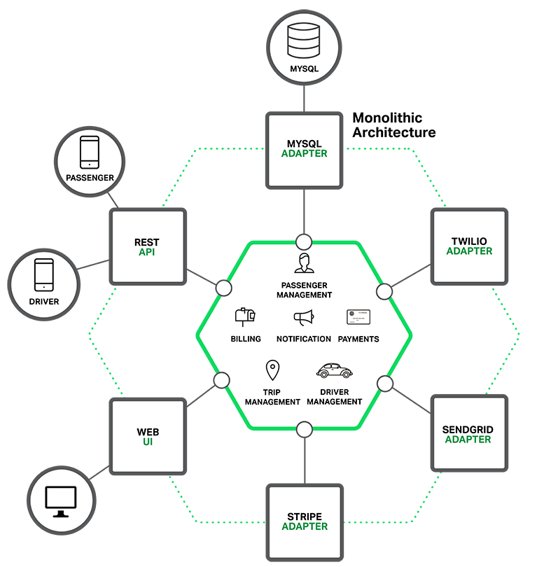

At the core of the application is the business logic, which is implemented by modules that define services, domain objects, and events. Surrounding the core are adapters that interface with the external world. Examples of adapters include database access components, messaging components that produce and consume messages, and web components that either expose APIs or implement a UI.

Despite having a logically modular architecture, the application is packaged and deployed as a monolith. The actual format depends on the application’s language and framework. For example, many Java applications are packaged as WAR files and deployed on application servers such as Tomcat or Jetty. Other Java applications are packaged as self‑contained executable JARs. Similarly, Rails and Node.js applications are packaged as a directory hierarchy.

Applications written in this style are extremely common. They are simple to develop since our IDEs and other tools are focused on building a single application. These kinds of applications are also simple to test. You can implement end‑to‑end testing by simply launching the application and testing the UI with Selenium. Monolithic applications are also simple to deploy. You just have to copy the packaged application to a server. You can also scale the application by running multiple copies behind a load balancer. In the early stages of the project it works well.

## Marching Towards Monolithic Hell

Unfortunately, this simple approach has a huge limitation. Successful applications have a habit of growing over time and eventually becoming huge. During each sprint, your development team implements a few more stories, which, of course, means adding many lines of code. After a few years, your small, simple application will have grown into a [monstrous monolith](https://microservices.io/patterns/monolithic.html). To give an extreme example, I recently spoke to a developer who was writing a tool to analyze the dependencies between the thousands of JARs in their multi‑million line of code (LOC) application. I’m sure it took the concerted effort of a large number of developers over many years to create such a beast.

Once your application has become a large, complex monolith, your development organization is probably in a world of pain. Any attempts at agile development and delivery will flounder. One major problem is that the application is overwhelmingly complex. It’s simply too large for any single developer to fully understand. As a result, fixing bugs and implementing new features correctly becomes difficult and time consuming. What’s more, this tends to be a downwards spiral. If the codebase is difficult to understand, then changes won’t be made correctly. You will end up with a monstrous, incomprehensible big ball of mud.

The sheer size of the application will also slow down development. The larger the application, the longer the start‑up time is. For example, in a recent survey some developers reported start‑up times as long as 12 minutes. I’ve also heard anecdotes of applications taking as long as 40 minutes to start up. If developers regularly have to restart the application server, then a large part of their day will be spent waiting around and their productivity will suffer.

Another problem with a large, complex monolithic application is that it is an obstacle to continuous deployment. Today, the state of the art for SaaS applications is to push changes into production many times a day. This is extremely difficult to do with a complex monolith since you must redeploy the entire application in order to update any one part of it. The lengthy start‑up times that I mentioned earlier won’t help either. Also, since the impact of a change is usually not very well understood, it is likely that you have to do extensive manual testing. Consequently, continuous deployment is next to impossible to do.

Monolithic applications can also be difficult to scale when different modules have conflicting resource requirements. For example, one module might implement CPU‑intensive image processing logic and would ideally be deployed in Amazon [EC2 Compute Optimized instances](https://aws.amazon.com/ru/about-aws/whats-new/2013/11/14/announcing-new-amazon-ec2-compute-optimized-instances/). Another module might be an in‑memory database and best suited for [EC2 Memory‑optimized instances](https://aws.amazon.com/ru/about-aws/whats-new/2014/04/10/r3-announcing-the-next-generation-of-amazon-ec2-memory-optimized-instances/). However, because these modules are deployed together you have to compromise on the choice of hardware.

Another problem with monolithic applications is reliability. Because all modules are running within the same process, a bug in any module, such as a memory leak, can potentially bring down the entire process. Moreover, since all instances of the application are identical, that bug will impact the availability of the entire application.

Last but not least, monolithic applications make it extremely difficult to adopt new frameworks and languages. For example, let’s imagine that you have 2 million lines of code written using the XYZ framework. It would be extremely expensive (in both time and cost) to rewrite the entire application to use the newer ABC framework, even if that framework was considerably better. As a result, there is a huge barrier to adopting new technologies. You are stuck with whatever technology choices you made at the start of the project.

To summarize: you have a successful business‑critical application that has grown into a monstrous monolith that very few, if any, developers understand. It is written using obsolete, unproductive technology that makes hiring talented developers difficult. The application is difficult to scale and is unreliable. As a result, agile development and delivery of applications is impossible.

So what can you do about it?

## Tackling the Complexity

Many organizations, such as Amazon, eBay, and [Netflix](https://www.nginx.com/blog/microservices-at-netflix-architectural-best-practices/), have solved this problem by adopting what is now known as the [Microservices Architecture pattern](https://microservices.io/patterns/microservices.html). Instead of building a single monstrous, monolithic application, the idea is to split your application into set of smaller, interconnected services.

A service typically implements a set of distinct features or functionality, such as order management, customer management, etc. Each microservice is a mini‑application that has its own hexagonal architecture consisting of business logic along with various adapters. Some microservices would expose an API that’s consumed by other microservices or by the application’s clients. Other microservices might implement a web UI. At runtime, each instance is often a cloud VM or a Docker container.

For example, a possible decomposition of the system described earlier is shown in the following diagram:

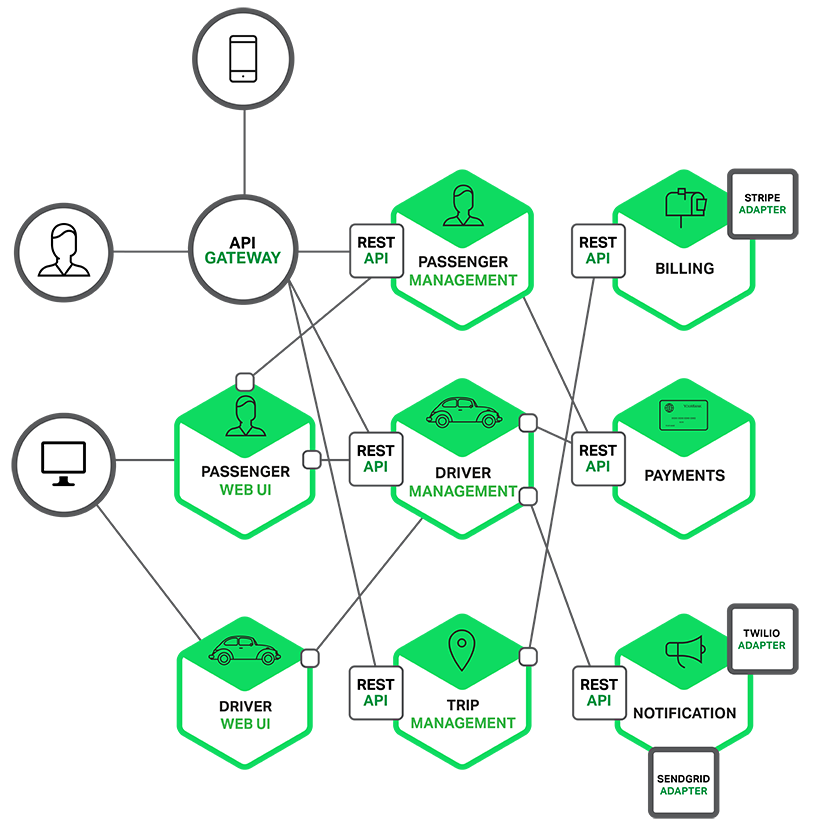

Each functional area of the application is now implemented by its own microservice. Moreover, the web application is split into a set of simpler web applications (such as one for passengers and one for drivers in our taxi‑hailing example). This makes it easier to deploy distinct experiences for specific users, devices, or specialized use cases.

Each backend service exposes a REST API and most services consume APIs provided by other services. For example, Driver Management uses the Notification server to tell an available driver about a potential trip. The UI services invoke the other services in order to render web pages. Services might also use asynchronous, message‑based communication. Inter‑service communication will be covered in more detail later in this series.

Some REST APIs are also exposed to the mobile apps used by the drivers and passengers. The apps don’t, however, have direct access to the backend services. Instead, communication is mediated by an intermediary known as an [API Gateway](https://microservices.io/patterns/apigateway.html). The API Gateway is responsible for tasks such as load balancing, caching, access control, API metering, and monitoring, and [can be implemented effectively using NGINX](https://www.nginx.com/solutions/api-management-gateway/). Later articles in the series will cover the [API gateway](https://www.nginx.com/blog/building-microservices-using-an-api-gateway/).

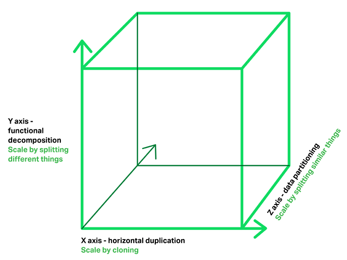

The Microservices Architecture pattern corresponds to the Y‑axis scaling of the [Scale Cube](https://microservices.io/articles/scalecube.html), which is a 3D model of scalability from the excellent book [The Art of Scalability](http://theartofscalability.com/). The other two scaling axes are X‑axis scaling, which consists of running multiple identical copies of the application behind a load balancer, and Z‑axis scaling (or data partitioning), where an attribute of the request (for example, the primary key of a row or identity of a customer) is used to route the request to a particular server.

Applications typically use the three types of scaling together. Y‑axis scaling decomposes the application into microservices as shown above in the first figure in this section. At runtime, X‑axis scaling runs multiple instances of each service behind a load balancer for throughput and availability. Some applications might also use Z‑axis scaling to partition the services. The following diagram shows how the Trip Management service might be deployed with Docker running on Amazon EC2.

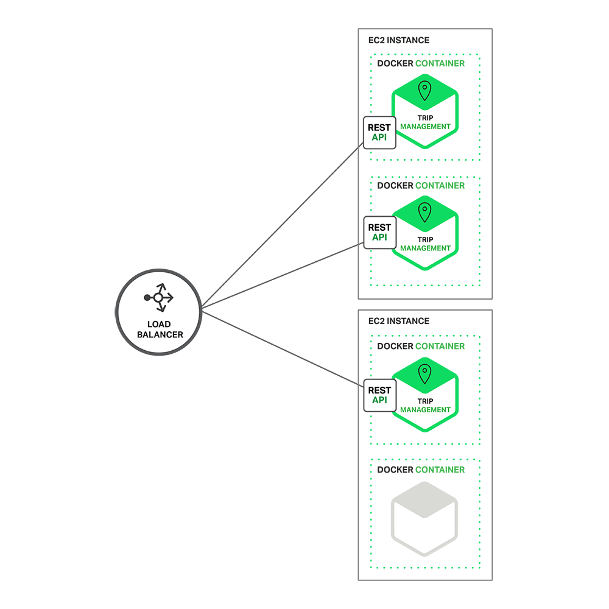

At runtime, the Trip Management service consists of multiple service instances. Each service instance is a Docker container. In order to be highly available, the containers are running on multiple Cloud VMs. In front of the service instances is a [load balancer such as NGINX](https://www.nginx.com/solutions/adc/) that distributes requests across the instances. The load balancer might also handle other concerns such as [caching](https://docs.nginx.com/nginx/admin-guide/content-cache/content-caching/?_ga=2.255896652.698031497.1652447399-1697960980.1652447399), [access control](https://docs.nginx.com/nginx/admin-guide/security-controls/controlling-access-proxied-http/?_ga=2.255896652.698031497.1652447399-1697960980.1652447399), [API metering](https://www.nginx.com/solutions/api-management-gateway/), and [monitoring](https://www.nginx.com/products/nginx/live-activity-monitoring/).

The Microservices Architecture pattern significantly impacts the relationship between the application and the database. Rather than sharing a single database schema with other services, each service has its own database schema. On the one hand, this approach is at odds with the idea of an enterprise‑wide data model. Also, it often results in duplication of some data. However, having a database schema per service is essential if you want to benefit from microservices, because it ensures loose coupling. The following diagram shows the database architecture for the example application.

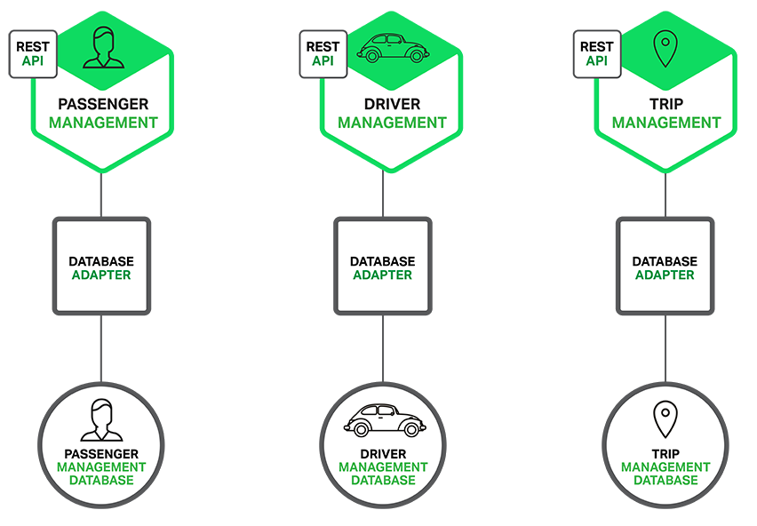

Each of the services has its own database. Moreover, a service can use a type of database that is best suited to its needs, the so‑called polyglot persistence architecture. For example, Driver Management, which finds drivers close to a potential passenger, must use a database that supports efficient geo‑queries.

On the surface, the Microservices Architecture pattern is similar to SOA. With both approaches, the architecture consists of a set of services. However, one way to think about the Microservices Architecture pattern is that it’s SOA without the commercialization and perceived baggage of [web service specifications](https://en.wikipedia.org/wiki/List_of_web_service_specifications) (WS‑*) and an Enterprise Service Bus (ESB). Microservice‑based applications favor simpler, lightweight protocols such as REST, rather than WS‑*. They also very much avoid using ESBs and instead implement ESB‑like functionality in the microservices themselves. The Microservices Architecture pattern also rejects other parts of SOA, such as the concept of a canonical schema.

## The Benefits of Microservices

The Microservices Architecture pattern has a number of important benefits. First, it tackles the problem of complexity. It decomposes what would otherwise be a monstrous monolithic application into a set of services. While the total amount of functionality is unchanged, the application has been broken up into manageable chunks or services. Each service has a well‑defined boundary in the form of an RPC‑ or message‑driven API. The Microservices Architecture pattern enforces a level of modularity that in practice is extremely difficult to achieve with a monolithic code base. Consequently, individual services are much faster to develop, and much easier to understand and maintain.

Second, this architecture enables each service to be developed independently by a team that is focused on that service. The developers are free to choose whatever technologies make sense, provided that the service honors the API contract. Of course, most organizations would want to avoid complete anarchy and limit technology options. However, this freedom means that developers are no longer obligated to use the possibly obsolete technologies that existed at the start of a new project. When writing a new service, they have the option of using current technology. Moreover, since services are relatively small it becomes feasible to rewrite an old service using current technology.

Third, the Microservices Architecture pattern enables each microservice to be deployed independently. Developers never need to coordinate the deployment of changes that are local to their service. These kinds of changes can be deployed as soon as they have been tested. The UI team can, for example, perform A/B testing and rapidly iterate on UI changes. The Microservices Architecture pattern makes continuous deployment possible.

Finally, the Microservices Architecture pattern enables each service to be scaled independently. You can deploy just the number of instances of each service that satisfy its capacity and availability constraints. Moreover, you can use the hardware that best matches a service’s resource requirements. For example, you can deploy a CPU‑intensive image processing service on EC2 Compute Optimized instances and deploy an in‑memory database service on EC2 Memory‑optimized instances.

## The Drawbacks of Microservices

As Fred Brooks wrote almost 30 years ago, there are no silver bullets. Like every other technology, the Microservices architecture has drawbacks. One drawback is the name itself. The term microservice places excessive emphasis on service size. In fact, there are some developers who advocate for building extremely fine‑grained 10–100 LOC services. While small services are preferable, it’s important to remember that they are a means to an end and not the primary goal. The goal of microservices is to sufficiently decompose the application in order to facilitate agile application development and deployment.

Another major drawback of microservices is the complexity that arises from the fact that a microservices application is a distributed system. Developers need to choose and implement an inter‑process communication mechanism based on either messaging or RPC. Moreover, they must also write code to handle partial failure since the destination of a request might be slow or unavailable. While none of this is rocket science, it’s much more complex than in a monolithic application where modules invoke one another via language‑level method/procedure calls.

Another challenge with microservices is the partitioned database architecture. Business transactions that update multiple business entities are fairly common. These kinds of transactions are trivial to implement in a monolithic application because there is a single database. In a microservices‑based application, however, you need to update multiple databases owned by different services. Using distributed transactions is usually not an option, and not only because of the CAP theorem. They simply are not supported by many of today’s highly scalable NoSQL databases and messaging brokers. You end up having to use an eventual consistency based approach, which is more challenging for developers.

Testing a microservices application is also much more complex. For example, with a modern framework such as Spring Boot it is trivial to write a test class that starts up a monolithic web application and tests its REST API. In contrast, a similar test class for a service would need to launch that service and any services that it depends upon (or at least configure stubs for those services). Once again, this is not rocket science but it’s important to not underestimate the complexity of doing this.

Another major challenge with the Microservices Architecture pattern is implementing changes that span multiple services. For example, let’s imagine that you are implementing a story that requires changes to services A, B, and C, where A depends upon B and B depends upon C. In a monolithic application you could simply change the corresponding modules, integrate the changes, and deploy them in one go. In contrast, in a Microservices Architecture pattern you need to carefully plan and coordinate the rollout of changes to each of the services. For example, you would need to update service C, followed by service B, and then finally service A. Fortunately, most changes typically impact only one service and multi‑service changes that require coordination are relatively rare.

Deploying a microservices‑based application is also much more complex. A monolithic application is simply deployed on a set of identical servers behind a traditional load balancer. Each application instance is configured with the locations (host and ports) of infrastructure services such as the database and a message broker. In contrast, a microservice application typically consists of a large number of services. For example, Hailo has 160 different services and Netflix has over 600 according to [Adrian Cockcroft](https://twitter.com/adrianco) _[Editor – Hailo has been acquired by MyTaxi.]_. Each service will have multiple runtime instances. That’s many more moving parts that need to be configured, deployed, scaled, and monitored. In addition, you will also need to implement a service discovery mechanism (discussed in a later post) that enables a service to discover the locations (hosts and ports) of any other services it needs to communicate with. Traditional trouble ticket‑based and manual approaches to operations cannot scale to this level of complexity. Consequently, successfully deploying a microservices application requires greater control of deployment methods by developers, and a high level of automation.

One approach to automation is to use an off‑the‑shelf PaaS such as [Cloud Foundry](https://www.cloudfoundry.org/). A PaaS provides developers with an easy way to deploy and manage their microservices. It insulates them from concerns such as procuring and configuring IT resources. At the same time, the systems and network professionals who configure the PaaS can ensure compliance with best practices and with company policies. Another way to automate the deployment of microservices is to develop what is essentially your own PaaS. One typical starting point is to use a clustering solution, such as [Kubernetes](https://kubernetes.io/), in conjunction with a technology such as Docker. Later in this series we will look at how [software‑based application delivery](https://www.nginx.com/products/nginx/) approaches like NGINX Plus, which easily handles caching, access control, API metering, and monitoring at the microservice level, can help solve this problem.

## Summary

Building complex applications is inherently difficult. A Monolithic architecture only makes sense for simple, lightweight applications. You will end up in a world of pain if you use it for complex applications. The Microservices architecture pattern is the better choice for complex, evolving applications despite the drawbacks and implementation challenges.

In later blog posts, I’ll dive into the details of various aspects of the Microservices Architecture pattern and discuss topics such as service discovery, service deployment options, and strategies for refactoring a monolithic application into services.

Stay tuned...

# Pattern: Monolithic Architecture

## Context

You are developing a server-side enterprise application. It must support a variety of different clients including desktop browsers, mobile browsers and native mobile applications. The application might also expose an API for 3rd parties to consume. It might also integrate with other applications via either web services or a message broker. The application handles requests (HTTP requests and messages) by executing business logic; accessing a database; exchanging messages with other systems; and returning a HTML/JSON/XML response. There are logical components corresponding to different functional areas of the application.

## Problem

What’s the application’s deployment architecture?

## Forces

- There is a team of developers working on the application
- New team members must quickly become productive
- The application must be easy to understand and modify
- You want to practice continuous deployment of the application
- You must run multiple instances of the application on multiple machines in order to satisfy scalability and availability requirements
- You want to take advantage of emerging technologies (frameworks, programming languages, etc)

## Solution

Build an application with a monolithic architecture. For example:

- a single Java WAR file.
- a single directory hierarchy of Rails or NodeJS code

## Example

Let’s imagine that you are building an e-commerce application that takes orders from customers, verifies inventory and available credit, and ships them. The application consists of several components including the StoreFrontUI, which implements the user interface, along with some backend services for checking credit, maintaining inventory and shipping orders.

The application is deployed as a single monolithic application. For example, a Java web application consists of a single WAR file that runs on a web container such as Tomcat. A Rails application consists of a single directory hierarchy deployed using either, for example, Phusion Passenger on Apache/Nginx or JRuby on Tomcat. You can run multiple instances of the application behind a load balancer in order to scale and improve availability.

## Resulting context

This solution has a number of benefits:

- Simple to develop - the goal of current development tools and IDEs is to support the development of monolithic applications
- Simple to deploy - you simply need to deploy the WAR file (or directory hierarchy) on the appropriate runtime
- Simple to scale - you can scale the application by running multiple copies of the application behind a load balancer

However, once the application becomes large and the team grows in size, this approach has a number of drawbacks that become increasingly significant:

- The large monolithic code base intimidates developers, especially ones who are new to the team. The application can be difficult to understand and modify. As a result, development typically slows down. Also, because there are not hard module boundaries, modularity breaks down over time. Moreover, because it can be difficult to understand how to correctly implement a change the quality of the code declines over time. It’s a downwards spiral.

- Overloaded IDE - the larger the code base the slower the IDE and the less productive developers are.

- Overloaded web container - the larger the application the longer it takes to start up. This had have a huge impact on developer productivity because of time wasted waiting for the container to start. It also impacts deployment too.

- Continuous deployment is difficult - a large monolithic application is also an obstacle to frequent deployments. In order to update one component you have to redeploy the entire application. This will interrupt background tasks (e.g. Quartz jobs in a Java application), regardless of whether they are impacted by the change, and possibly cause problems. There is also the chance that components that haven’t been updated will fail to start correctly. As a result, the risk associated with redeployment increases, which discourages frequent updates. This is especially a problem for user interface developers, since they usually need to iterative rapidly and redeploy frequently.

- Scaling the application can be difficult - a monolithic architecture is that it can only scale in one dimension. On the one hand, it can scale with an increasing transaction volume by running more copies of the application. Some clouds can even adjust the number of instances dynamically based on load. But on the other hand, this architecture can’t scale with an increasing data volume. Each copy of application instance will access all of the data, which makes caching less effective and increases memory consumption and I/O traffic. Also, different application components have different resource requirements - one might be CPU intensive while another might memory intensive. With a monolithic architecture we cannot scale each component independently

- Obstacle to scaling development - A monolithic application is also an obstacle to scaling development. Once the application gets to a certain size its useful to divide up the engineering organization into teams that focus on specific functional areas. For example, we might want to have the UI team, accounting team, inventory team, etc. The trouble with a monolithic application is that it prevents the teams from working independently. The teams must coordinate their development efforts and redeployments. It is much more difficult for a team to make a change and update production.

- Requires a long-term commitment to a technology stack - a monolithic architecture forces you to be married to the technology stack (and in some cases, to a particular version of that technology) you chose at the start of development . With a monolithic application, can be difficult to incrementally adopt a newer technology. For example, let’s imagine that you chose the JVM. You have some language choices since as well as Java you can use other JVM languages that inter-operate nicely with Java such as Groovy and Scala. But components written in non-JVM languages do not have a place within your monolithic architecture. Also, if your application uses a platform framework that subsequently becomes obsolete then it can be challenging to incrementally migrate the application to a newer and better framework. It’s possible that in order to adopt a newer platform framework you have to rewrite the entire application, which is a risky undertaking.

## Related patterns

The [microservice architecture](https://microservices.io/patterns/microservices.html) is an alternative pattern that addresses the limitations of the monolithic architecture.

## Known uses

Well known internet services such as Netflix, [Amazon.com](https://www.amazon.com/) and eBay initially had a monolithic architecture. Most web applications developed by the author had a monolithic architecture.

# Service-Oriented Architecture Explained

Service oriented architecture (SOA) refers to the software architecture design paradigm that allows software components to behave as separate, autonomous, loosely coupled network-accessible units.

The use of SOA is on the rise. Let’s take a look at how SOA works—and why businesses are adopting it.

## How service oriented architecture works

In SOA, software components function as their own loosely coupled units. These units provide services or data using a network protocol, making them independent of vendors or proprietary technology systems.

These services can be independent, repeatable, and self-contained tasks of a global system functionality—consider them the building blocks of a large consumer service where each feature is composed of multiple small services that can be developed, managed, modified and replaced independently of other components (and services).

(Compare [SOA to microservice architecture](https://www.bmc.com/blogs/microservices-vs-soa-whats-difference/).)

Service Oriented Architecture allows the flexibility to treat every component independent of the global service that requires those components. This approach solves some of the key challenges facing large enterprise IT systems and has driven the growth and popularity of the SOA design paradigm.

Most of the drivers are shared across earlier design philosophies like object-oriented programming and component-based engineering, [such as](https://en.wikipedia.org/wiki/Service-orientation):

- Multiple use
- Non-context-specific
- Composable
- Encapsulated
- Components independent deployment and versioning

Before we discuss why it’s important to adopt an SOA approach for software and systems design, it’s important to understand its characteristics and driving factors. What makes SOA valuable to organizations operating large complex and distributed IT environments?

## What is loose coupling?

Let’s start with the term loose coupling.

The term “loose coupling” refers to the client of a service, and its ability to remain independent of the service that it requires. The most important part of this concept is that the client, which in itself can be a service, can communicate with the service even if they are not closely related.

This facilitated communication is achieved through the implementation of a specified interface that is able to perform the necessary actions to allow for the transmission of data.

A common example of this increased ability to communicate without service constraints involves [coding languages](https://www.bmc.com/blogs/programming-languages/) used by these services. There is an array of different languages from which software platforms are created and not all of these languages can interact fluently, without encountering communication issues. By using an SOA, it is not necessary for the client to understand the language that is being used by the service, but instead, it relies on a structured interface that is able to process the transmission between the service and the client.

## Drivers of service oriented architecture

The more prevalent factors driving interest and growth of SOA capabilities in the modern software engineering landscape include:

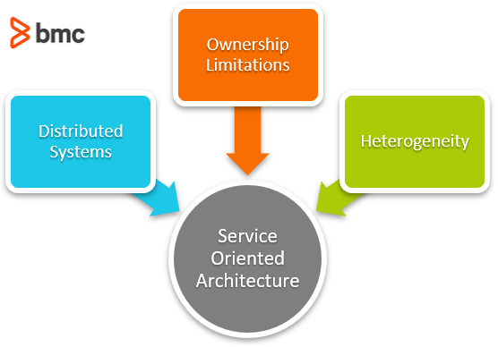

## Distributed systems

Modern enterprise IT solutions are built on multiple layers of technology that evolve constantly. New components are integrated and legacy systems are updated, infrastructure resources are provisioned and scaled to meet variable and unpredictable demand.

When the underlying services are loosely coupled, they can be located and communicate with each other through an interface, such as an API, over the network using standardized protocols of [the OSI model](https://www.bmc.com/blogs/osi-model-7-layers/). These protocols are supported by open source and proprietary technology vendors alike.

Designing the software architecture specifically with the openness and standardization to interact with a variety of services is a necessary imperative for large-scale distributed networks.

## Ownership limitations

Business organizations subscribe to [cloud-based services](https://www.bmc.com/blogs/saas-vs-paas-vs-iaas-whats-the-difference-and-how-to-choose/) for the convenience of provisioning hardware resources without doing any of the heavy lifting. Cloud solutions are operated and managed by third-party vendors while customers access the service through a Web interface.

These customers must also ensure that the cloud service interacts with their existing systems and with their data assets without technical limitations such as:

- Integration
- Performance
- Standardization issues

Cloud vendors, on the other hand, can only offer limited control and visibility into the hardware components that power their cloud services.

The conflict in ownership domains of these underlying components is a driving factor for services in distributed systems to interact with each other, without requiring ownership and control over those components. Customers of cloud services cannot modify the behavior of the cloud infrastructure.

Similarly, it’s important for vendors to modify small system components, without necessarily modifying the system-wide functionality.

## Heterogeneity

Large, distributed, and complex systems inherently lack harmony. Many systems are developed in different times—some evolve and replace, some are maintained as legacy systems. Old programming languages and platforms do not maintain the same high level of support or popularity over the course of their entire lifecycle.

The Service Oriented Architecture supports this behavior—allowing organizations to adopt agile design methodologies. Heterogeneity of the entire architecture itself is not the goal of SOA, but it ensures practices such as:

- Vendor diversity
- Agnostic platforms
- Programming languages

When the diverse services are interoperable, organizations can avoid [vendor lock-in](https://www.bmc.com/blogs/vendor-lock-in/) and establish independent services that can be leveraged without having to modify or control the underlying components and services.

There is no doubt that as web application technologies continue to evolve, more businesses will utilize the power of SOA. By switching to a standardized communication protocol, engineers will be able to create software applications without having to worry about the languages on which platforms are built, and can instead rely upon the interoperability that the SOA structure creates.

Finally, SOA can help ensure that applications can be easily scaled, while at the same time decreasing the costs that are often encountered when developing business service solutions.

# Pattern: Microservice Architecture

## Context

You are developing a server-side enterprise application. It must support a variety of different clients including desktop browsers, mobile browsers and native mobile applications. The application might also expose an API for 3rd parties to consume. It might also integrate with other applications via either web services or a message broker. The application handles requests (HTTP requests and messages) by executing business logic; accessing a database; exchanging messages with other systems; and returning a HTML/JSON/XML response. There are logical components corresponding to different functional areas of the application.

## Problem

What’s the application’s deployment architecture?

## Forces

- There is a team of developers working on the application
- New team members must quickly become productive
- The application must be easy to understand and modify
- You want to practice continuous deployment of the application
- You must run multiple instances of the application on multiple machines in order to satisfy scalability and availability requirements
- You want to take advantage of emerging technologies (frameworks, programming languages, etc)

## Solution

Define an architecture that structures the application as a set of loosely coupled, collaborating services. This approach corresponds to the Y-axis of the [Scale Cube](https://microservices.io/articles/scalecube.html). Each service is:

- Highly maintainable and testable - enables rapid and frequent development and deployment
- Loosely coupled with other services - enables a team to work independently the majority of time on their service(s) without being impacted by changes to other services and without affecting other services
- Independently deployable - enables a team to deploy their service without having to coordinate with other teams
- Capable of being developed by a small team - essential for high productivity by avoiding the high communication head of large teams

Services communicate using either synchronous protocols such as HTTP/REST or asynchronous protocols such as AMQP. Services can be developed and deployed independently of one another. Each service has its [own database](https://microservices.io/patterns/data/database-per-service.html) in order to be decoupled from other services. Data consistency between services is maintained using the [Saga pattern](https://microservices.io/patterns/data/saga.html)

To learn more about the nature of a service, please [read this article](http://chrisrichardson.net/post/microservices/general/2019/02/16/whats-a-service-part-1.html).

## Example

### Fictitious e-commerce application

Let’s imagine that you are building an e-commerce application that takes orders from customers, verifies inventory and available credit, and ships them. The application consists of several components including the StoreFrontUI, which implements the user interface, along with some backend services for checking credit, maintaining inventory and shipping orders. The application consists of a set of services.

### Show me the code

Please see [the example applications developed by Chris Richardson](https://eventuate.io/exampleapps.html). These examples on Github illustrate various aspects of the microservice architecture.

## Resulting context

### Benefits

This solution has a number of benefits:

- Enables the continuous delivery and deployment of large, complex applications.
    - Improved maintainability - each service is relatively small and so is easier to understand and change
    - Better testability - services are smaller and faster to test
    - Better deployability - services can be deployed independently
    - It enables you to organize the development effort around multiple, autonomous teams. Each (so called two pizza) team owns and is responsible for one or more services. Each team can develop, test, deploy and scale their services independently of all of the other teams.
- Each microservice is relatively small:
    - Easier for a developer to understand
    - The IDE is faster making developers more productive
    - The application starts faster, which makes developers more productive, and speeds up deployments
- Improved fault isolation. For example, if there is a memory leak in one service then only that service will be affected. The other services will continue to handle requests. In comparison, one misbehaving component of a monolithic architecture can bring down the entire system.
- Eliminates any long-term commitment to a technology stack. When developing a new service you can pick a new technology stack. Similarly, when making major changes to an existing service you can rewrite it using a new technology stack.

### Drawbacks

This solution has a number of drawbacks:

- Developers must deal with the additional complexity of creating a distributed system:
    - Developers must implement the inter-service communication mechanism and deal with partial failure
    - Implementing requests that span multiple services is more difficult
    - Testing the interactions between services is more difficult
    - Implementing requests that span multiple services requires careful coordination between the teams
    - Developer tools/IDEs are oriented on building monolithic applications and don’t provide explicit support for developing distributed applications.
- Deployment complexity. In production, there is also the operational complexity of deploying and managing a system comprised of many different services.
- Increased memory consumption. The microservice architecture replaces N monolithic application instances with NxM services instances. If each service runs in its own JVM (or equivalent), which is usually necessary to isolate the instances, then there is the overhead of M times as many JVM runtimes. Moreover, if each service runs on its own VM (e.g. EC2 instance), as is the case at Netflix, the overhead is even higher.

## Issues

There are many issues that you must address.

### When to use the microservice architecture?

One challenge with using this approach is deciding when it makes sense to use it. When developing the first version of an application, you often do not have the problems that this approach solves. Moreover, using an elaborate, distributed architecture will slow down development. This can be a major problem for startups whose biggest challenge is often how to rapidly evolve the business model and accompanying application. Using Y-axis splits might make it much more difficult to iterate rapidly. Later on, however, when the challenge is how to scale and you need to use functional decomposition, the tangled dependencies might make it difficult to decompose your monolithic application into a set of services.

### How to decompose the application into services?

Another challenge is deciding how to partition the system into microservices. This is very much an art, but there are a number of strategies that can help:

- [Decompose by business capability](https://microservices.io/patterns/decomposition/decompose-by-business-capability.html) and define services corresponding to business capabilities.
- [Decompose by domain-driven design subdomain](https://microservices.io/patterns/decomposition/decompose-by-subdomain.html).
- Decompose by verb or use case and define services that are responsible for particular actions. e.g. a `Shipping Service` that’s responsible for shipping complete orders.
- Decompose by nouns or resources by defining a service that is responsible for all operations on entities/resources of a given type. e.g. an `Account Service` that is responsible for managing user accounts.

Ideally, each service should have only a small set of responsibilities. (Uncle) Bob Martin talks about designing classes using the [Single Responsibility Principle (SRP)](https://www.booked.net/objectmentor). The SRP defines a responsibility of a class as a reason to change, and states that a class should only have one reason to change. It make sense to apply the SRP to service design as well.

Another analogy that helps with service design is the design of Unix utilities. Unix provides a large number of utilities such as grep, cat and find. Each utility does exactly one thing, often exceptionally well, and is intended to be combined with other utilities using a shell script to perform complex tasks.

### How to maintain data consistency?

In order to ensure loose coupling, each service has its own database. Maintaining data consistency between services is a challenge because 2 phase-commit/distributed transactions is not an option for many applications. An application must instead use the [Saga pattern](https://microservices.io/patterns/data/saga.html). A service publishes an event when its data changes. Other services consume that event and update their data. There are several ways of reliably updating data and publishing events including [Event Sourcing](https://microservices.io/patterns/data/event-sourcing.html) and [Transaction Log Tailing](https://microservices.io/patterns/data/transaction-log-tailing.html).

### How to implement queries?

Another challenge is implementing queries that need to retrieve data owned by multiple services.

- The [API Composition](https://microservices.io/patterns/data/api-composition.html) and [Command Query Responsibility Segregation (CQRS)](https://microservices.io/patterns/data/cqrs.html) patterns.

## Related patterns

There are many patterns related to the microservices pattern. The [Monolithic architecture](https://microservices.io/patterns/monolithic.html) is an alternative to the microservice architecture. The other patterns address issues that you will encounter when applying the microservice architecture.

- Decomposition patterns
    - [Decompose by business capability](https://microservices.io/patterns/decomposition/decompose-by-business-capability.html)
    - [Decompose by subdomain](https://microservices.io/patterns/decomposition/decompose-by-subdomain.html)
- The [Database per Service pattern](https://microservices.io/patterns/data/database-per-service.html) describes how each service has its own database in order to ensure loose coupling.
- The [API Gateway pattern](https://microservices.io/patterns/apigateway.html) defines how clients access the services in a microservice architecture.
- The [Client-side Discovery](https://microservices.io/patterns/client-side-discovery.html) and [Server-side Discovery](https://microservices.io/patterns/server-side-discovery.html) patterns are used to route requests for a client to an available service instance in a microservice architecture.
- The Messaging and Remote Procedure Invocation patterns are two different ways that services can communicate.
- The [Single Service per Host](https://microservices.io/patterns/deployment/single-service-per-host.html) and [Multiple Services per Host](https://microservices.io/patterns/deployment/multiple-services-per-host.html) patterns are two different deployment strategies.
- Cross-cutting concerns patterns: [Microservice chassis pattern](https://microservices.io/patterns/microservice-chassis.html) and [Externalized configuration](https://microservices.io/patterns/externalized-configuration.html)
- Testing patterns: [Service Component Test](https://microservices.io/patterns/testing/service-component-test.html) and [Service Integration Contract Test](https://microservices.io/patterns/testing/service-integration-contract-test.html)
- [Circuit Breaker](https://microservices.io/patterns/reliability/circuit-breaker.html)
- [Access Token](https://microservices.io/patterns/security/access-token.html)
- Observability patterns:
    - [Log aggregation](https://microservices.io/patterns/observability/application-logging.html)
    - [Application metrics](https://microservices.io/patterns/observability/application-metrics.html)
    - [Audit logging](https://microservices.io/patterns/observability/audit-logging.html)
    - [Distributed tracing](https://microservices.io/patterns/observability/distributed-tracing.html)
    - [Exception tracking](https://microservices.io/patterns/observability/exception-tracking.html)
    - [Health check API](https://microservices.io/patterns/observability/health-check-api.html)
    - [Log deployments and changes](https://microservices.io/patterns/observability/log-deployments-and-changes.html)
- UI patterns:
    - [Server-side page fragment composition](https://microservices.io/patterns/ui/server-side-page-fragment-composition.html)
    - [Client-side UI composition](https://microservices.io/patterns/ui/client-side-ui-composition.html)

## Known uses

Most large scale web sites including Netflix, [Amazon](http://highscalability.com/blog/2007/9/18/amazon-architecture.html) and [eBay](http://www.addsimplicity.com/downloads/eBaySDForum2006-11-29.pdf) have evolved from a monolithic architecture to a microservice architecture.

Netflix, which is a very popular video streaming service that’s responsible for up to 30% of Internet traffic, has a large scale, service-oriented architecture. They handle over a billion calls per day to their video streaming API from over 800 different kinds of devices. Each API call fans out to an average of six calls to backend services.

[Amazon.com](https://www.amazon.com/) originally had a two-tier architecture. In order to scale they migrated to a service-oriented architecture consisting of hundreds of backend services. Several applications call these services including the applications that implement the [Amazon.com](https://www.amazon.com/) website and the web service API. The [Amazon.com](https://www.amazon.com/) website application calls 100-150 services to get the data that used to build a web page.

The auction site [ebay.com](https://www.ebay.com/) also evolved from a monolithic architecture to a service-oriented architecture. The application tier consists of multiple independent applications. Each application implements the business logic for a specific function area such as buying or selling. Each application uses X-axis splits and some applications such as search use Z-axis splits. [Ebay.com](https://www.ebay.com/) also applies a combination of X-, Y- and Z-style scaling to the database tier.

There are [numerous other examples](https://microservices.io/articles/whoisusingmicroservices.html) of companies using the microservice architecture.

## Examples

Chris Richardson has [examples](https://eventuate.io/exampleapps.html) of microservices-based applications.

## See also

See my [Code Freeze 2018 keynote](https://microservices.io/microservices/news/2018/02/20/no-such-thing-as-a-microservice.html), which provides a good introduction to the microservice architecture.

# Monolithic vs. Microservices Architecture: How the Software Structure Can Influence the Efficiency

A lot of efforts and money can be saved with the help of proper  IT architecture. In many cases, it generally determines whether your digital project will survive or not. What architecture will be the right choice for your company project? Let’s figure it out.

## Monolithic Architecture vs Microservices: What’s What

A **monolithic architecture** is a software development program designed to be self-contained and to work independently from any other software applications. So, a monolith programmed as a complete system in order to execute the whole cycle of operation to realise a particular business task.

A **microservice architecture, or just microservices**, is a software system whose structure is divided into separate blocks, so the architecture of the software consists of a number of independent modules. Such a structure helps to develop scalable software solutions, providing the transparency of separate functions and overall project flexibility. This setup is widely used in service-oriented architecture (SOA).

Let’s make it simple. Here is an example of the potential implementation of a hypothetical video sharing platform: first in a monolithic representation (one large block) and then in a microservice one.

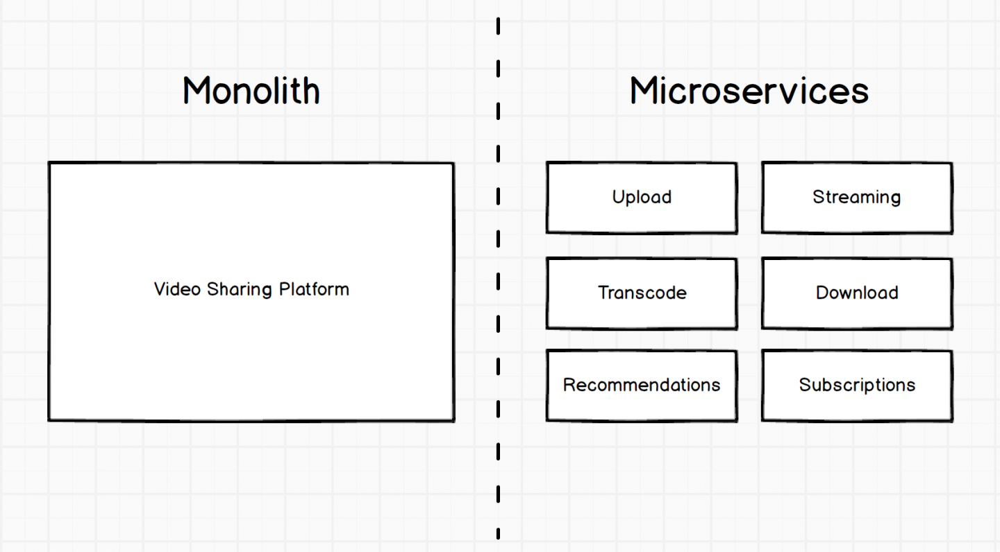

_The difference is that the first is a single large block, i.e. monolith. The second is a set of small functional services. Each service has its own specific role._

## Monolith

Software with a monolithic architecture comprises applications with a multi-layered structure. A classic example is the use of three-layer architecture, where one level is responsible for interaction with the user, the second for business logic processing and the third for communication with the server, providing access to data.

- **User Interface**. This is the presentation layer with which the user interacts. It includes user interface components such as CSS styles, static html pages and JavaScript code. The main function of the presentation layer is to display information and interpret user input commands, transforming them into appropriate operations in the context of business logic.
- **Business logic layer**. This comprises the set of components responsible for processing data received from the presentation layer. It directly interacts with the data access layer and can be implemented using Java EE and ASP.NET technologies.
- **Data access layer**. The third layer stores data models used by entities within the business logic of the app. It is responsible for monitoring transactions and maintaining a consistent data state. For most corporate software applications, most of the logic of the data access layer is concentrated in a DBMS (Database Management System) such as Oracle, MySQL or PostgreSQL.

Here’s an example of a simple web app code with a monolithic architecture, located on the server, which displays a particular page depending on the query that comes to the server.

_This application is written in PHP. The entry point to the app is the index.php file, which processes all incoming requests. When you log into a web application, PHP includes the get_server_params method from the file of the same name, which is located in the utils folder, and later uses it to obtain the value contained in the "REQUEST_URI" property that came with the request to the server._

In fact, applications, even in the case of a monolithic architecture, will appear more structured and coherent, and will also have a more elaborate system of routes – in this example, the usual switch-case is responsible for this.

## Advantages of monolithic architecture

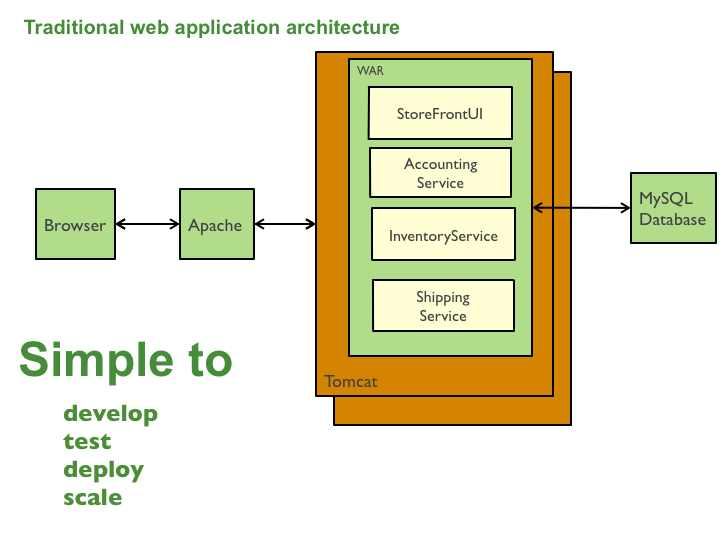

- **Simplicity**. Monolithic architecture is easier to implement, deploy and control.
- **Consistency**. With a monolithic architecture, it is easier to maintain code consistency, handle errors and so on.
- **Inter-module refactoring**. A single architecture makes it easier to work in situations where several modules must interact with each other or when we want to move classes from one module to another.

Meanwhile, corporate solutions are rapidly evolving, becoming fragmented. They can provide some functionality and can be used as a part of another app using web services based on REST, SOAP and XML-RPC protocols. This leads to applications with a monolithic architecture becoming more vulnerable in terms of security due to a growing number of different systems that should communicate and get access to these layers. Difficulties with the implementation of asynchronous communication between apps thus emerge and the need arises across the whole system for complex mechanisms for managing transactions between logically separate apps and the monolith levels.

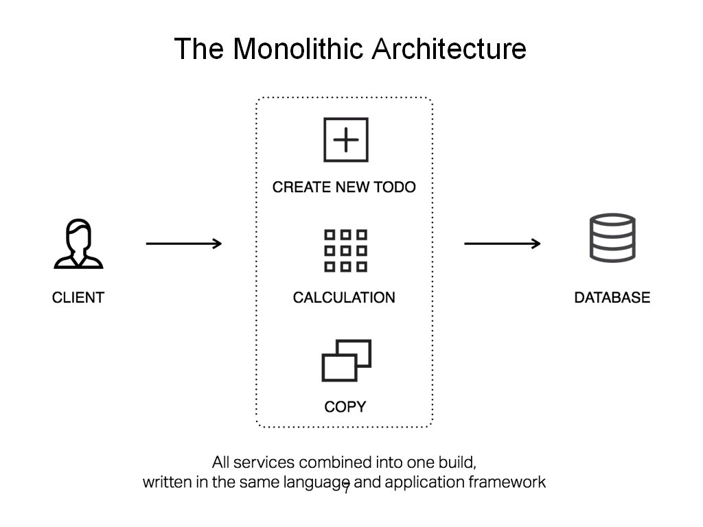

## Main disadvantages of monolithic architecture

- It is difficult or almost impossible to change the technological stack of a web application after development. -> Limitations in providing the new functionality can lead to the creation of a new system from scratch, demanding global investment from the business.
- The need for a complete system upgrade when minor details of the app are changed;  -> Complicated programming and a long testing period for each system alteration lead to an increase in the number of possible errors for the user and a more expensive redevelopment process for the owners.
- If the app crashes, then all functionality is rendered unavailable to users;-> the impact on the whole business is immeasurable.
- Complexity in scaling -> Lack of flexibility for the growing company.

In general, the monolithic architecture of software solutions doesn’t allow for rapid response to changes in the market and the new business needs.

## Microservices

The microservice architecture was born from the limitations that emerged within monolithic systems. The main difference between microservice and monolithic architectures is the use of specialised blocks (modules) for executing the separate functions of an app. Microservices are autonomous.

## What is microservice architecture?

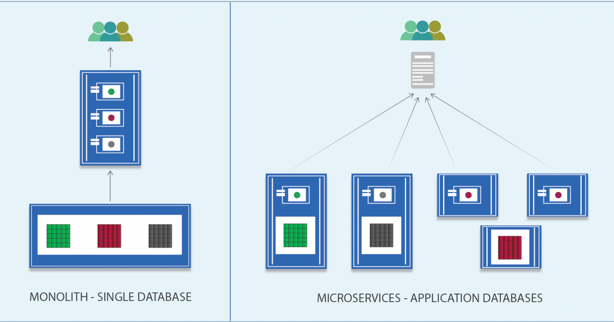

Microservice is an architectural template whereby your app consists of many small services that interact with each other by messaging. These can be requests from Cloud Haskell, Erlang, Akka, or REST API, Thrift, Protobuf, MessagePack and so on. All the services that conform to this template are:

- **Small**. The service should not require many people to develop. One team can develop several services.
- **Focused**. One service equals one task.
- **Weakly-bound**. Changes to one service do not affect the other.
- **Highly coordinated**. A component or class is created taking into account all methods of solving a business problem.

**A classic monolithic application usually has a standard Interface structure -> Business logic -> Data.**

## Microservices are based on the following roots

One service must solve one task and these tasks are determined by the relevant, responsible parts of the app. The main advantage of this architecture is the quick response to data requests outside the block, be it the internal service or external agent.

For example, there may be different services for building an internet ecommerce system with integrated logistics services. In this case it is worth isolating the internet-orders, delivery and warehouse inventory functions into separate microservices. Working smoothly, each module will exchange necessary information with the others, decreasing the pressure on the whole system and providing results quickly and responsively, provided the communication is well-organised.

## Microservices must communicate separately

Devising the optimal communication schema is a difficult task. You have to organise the data exchange for each of the modules separately, providing authorised access to internal and external visitors at the same time.

Watch this video with the IT expert Josh Evans for a clear explanation of the above-mentioned approach to microservices.

If you’re interested in the technical part of the data exchange, here is the relevant discussion of the programming intricacies.

of the data exchange, here is the relevant [discussion of the programming intricacies](https://dev.to/senornigeria/microservice-data-sharing-and-communication--5gn4).

## How microservices work – a practical example

Amazon is a classic example of the implementation of a microservice architecture system. If you’re switching from the products to the recommendation block and it isn’t working, you’ll see "recommendations are not available", but all the other features are working well. Nothing fatal has happened and the transactions are functioning on the usual basis. If it was a monolith, however, you’d get no answer to your request at all.

## When applied

Usually, microservice architecture is used as one of the options for scaling an app. There are three such options:

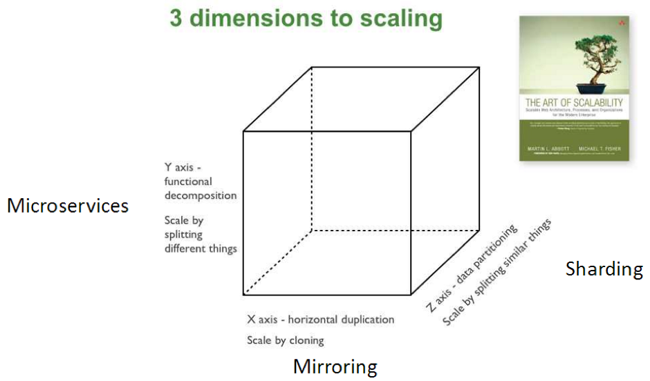

- **Microservices** – the functionality is broken down into business tasks and each service can be created with its own development tools.
- **Sharding** (also called "splitting" or simply "shading") – the data and tools for access to them are placed on different nodes.
- **Mirroring** – duplication of all data on a set of identical nodes.

**Despite the overall simplicity of the program structure with microservices,  building the composite service for the data transfer within all the separated blocks is becoming a non-trivial task. If you need more technical details, read [this article about](https://medium.com/microservices-in-practice/microservices-layered-architecture-88a7fc38d3f1) the technologies for creating microservices.**

The microservice approach to software design is not the best choice and not the worst, but simply one of the options available. To decide whether to build an app from a set of unrelated parts, you need to weight the pros and cons of this approach.

## Benefits

- **Flexibility**: changes can be easily applied to any part of the system (module) and independence from other modules guarantees bug-free operation and a quick and simple testing process.
- **Clear division by modules**. Transparent module structure, simple code review and decompilation of the tasks among the internal development team or external vendors. Simple integration of new features and changes to the existing functional blocks.
- **High availability**. If any part of the monolith breaks, the whole app will break. With microservices, it's different: some services (except for critical modules, such as authorisation) may not work, but the application will remain available for users.
- **Various technologies**. When developing each service, you are free to choose the tools and the developers that are best suited to the specific task. Microservice architecture also allows you to try a new technology on a separate service, without overwriting the entire system. This flexibility offers the chance to divide system development among several separated teams, speeding up progress and diminishing the risks of fatal errors.
- **Relative simplicity of deployment**. Each service is raised independently, which makes the deployment and debugging process simpler, the structure - transparent and the compilation - quicker.

## Challenges

- **Implementation**: there are more units, which means more complex scripts, configuration files and transfer areas are needed to monitor implementation.
- **Performance**: Microservices are more likely to face the need of communication through the network, while the monolith can benefit from local calls.
- **Management**: The workload of management operations increases as there are more  log files, runtime components and point-to-point interactions to monitor.
- **Testability**: integration tests are more difficult to configure and execute because they can span microservices in different runtime environments.
- **Runtime autonomy**: The business logic is distributed via microservices. Therefore, under other identical conditions, microservices are more likely to interact with other services through the network; this interaction reduces autonomy. We can use techniques such as event-based architecture, final consistency, caching (data replication), CQRS and microservice alignment with contexts delimited by DDD to avoid runtime autonomy.
- **Memory usage**: multiple classes and libraries are generally replicated in each package and the overall memory footprint is increased.

To find out more about the potential challenges of microservice logic development and see some concrete examples realised in real cases, read this [article](https://stackoverflow.com/questions/41640621/data-sharing-between-micro-services).

## Monolith or Microservices: Which to Choose?

Monolith vs. Microservices is a complex choice between two options. Both are fuzzy definitions, and many systems are in a diffuse boundary area. There are also other systems that don’t fit into either of these categories. But here are some tips to help you make up your mind.

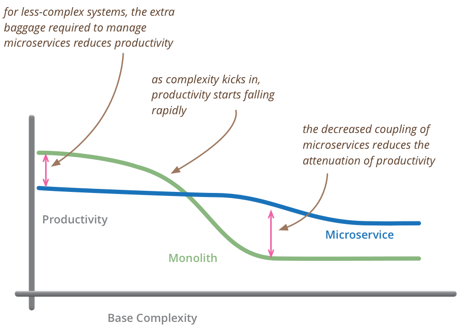

_“When you use microservices you have to work on automated deployment, monitoring, dealing with failure, eventual consistency, and other factors that a distributed system introduces.” Resource: https://martinfowler.com/bliki/MicroservicePremium.html_

**You may start with a monolith if:**

- **You’re building an MVP or trying to proof your idea**. In this case your project is likely to evolve over time, but for now, when you need to get to market as soon as possible, a monolith is ideal to start off with.
- **You’re developing a small app with simple functionality**. You may update it in the future, but it’s not going to grow into something more than what it is. So, a monolith can be the right fit.

You may start with microservices if:

- **You need independent service delivery**. If your main goal is to have individual parts within a larger, integrated system, microservice architecture is the right way to go.
- **You plan to grow your software**. Starting with microservice architecture, you get a lot of space for further development. You get high scalability of the system and don’t have to worry about the team, as new parts of the system can be written in other languages or with the use of other tools.

## Typical Problems

When you choose microservice architecture, you will increase decoupling and separation of interests – because you are actually splitting your app. This makes your code base easier to manage (each application is kept separate). So if you do it right, it will be easier to add new features to your app in the future. If you use a monolith and your app is large, this can become very difficult (and you can assume this will happen at some point).

Deploying applications is also easier because you can create separate services and deploy them to different servers. This means that you can develop and deploy them at any time without having to re-create the rest of the software. This is particularly useful with service apps that can be extended separately from the rest of the system.

However, for a software system that will not be managed much in the future it's best to keep it in a monolithic architecture. There are some serious difficulties with the microservice architecture. Using microservices increases the complexity of distribution of services to different servers in different locations, and you need to find a way to manage all of them.

**Looking for a compromise? Have your heard about the Semi-monolith?**

Instead of creating a very complicated structure, there is a way to divide this complete system into 2-3 parts. This is semi-monolith architecture. It could be a good alternative... though in reality, such a structure can be quite harmful: decoupling works leads to all the difficulties associated with communication between separate blocks of program, which must be worked out for any microformat architecture and have the same flexibility issues and limitations as the classical monolith. So, it’s the way to even more complications…

**If your product is oriented towards integration with external services (like the solutions for [Amazon](https://apievangelist.com/2012/01/12/the-secret-to-amazons-success-internal-apis/), eBay, [PayPal](https://medium.com/containerum/10-tech-challenges-that-are-solved-by-microservices-d91adeecb2e7), Twitter and other tech stars, building a microservice will be a beneficial choice in the long run, but for smaller apps, it's much easier to stay in a monolith.**

## Are You Ready to Make the Choice?

We’ve tried here to share with you all the pros and cons of each of the software architecture approaches. Each advantage and disadvantage should be assessed from the point of view of business values and future perspectives.

Sometimes an advantage becomes a disadvantage and vice versa (for example, hard module boundaries are good in complex systems, but an excessive load for simple ones).

The decisions you make depend on applying these criteria to your situation, assessing the critical factors for your system and how they affect the results. In most cases, it is very difficult to find the right solution without an expert’s advice. If this is what you need, just contact us.

# Microservices vs SOA: What's the Difference?

Are microservices the new SOA? Do people still talk about SOA? Let's investigate the differences between monoliths and these two newer architectures.

In the previous blog, ["What Is Microservices"](https://www.edureka.co/blog/what-is-microservices/), you got to know that SOA and microservices, which have distributed architectures, offer significant advantages over monolithic architecture. In this blog, I will explain layered-based architectures and tell you the difference between microservices and SOA architecture.

Before we dive into the differences between microservices and SOA, let me just tell you the basic differences between monolithic architecture, SOA, and microservices:

In layman's terms, a **monolith** is similar to a big container wherein all the software components of an application are assembled together and tightly packaged.

**Service-oriented architecture** is essentially a collection of services. These services communicate with each other. The communication can involve either simple data passing or two or more services coordinating some activity. Some means of connecting services to each other is needed.

**Microservices**, aka [microservice architecture](https://www.edureka.co/blog/microservice-architecture/), is an architectural style that structures an application as a collection of small autonomous services modeled around a business domain.

You can also watch the below video, where our microservice architecture expert has explained the differences between microservices architecture and SOA.

[Edureka Microservices vs SOA Tutorial](https://www.youtube.com/watch?v=EpyPFnjue38)

Now, let us see the key differences between microservices and SOA:

## Microservices vs SOA

When comparing microservices to SOA, they both rely on services as the main component, but they vary greatly in terms of service characteristics.

## Service Oriented Architecture

SOA defines four basic service types, as depicted below:

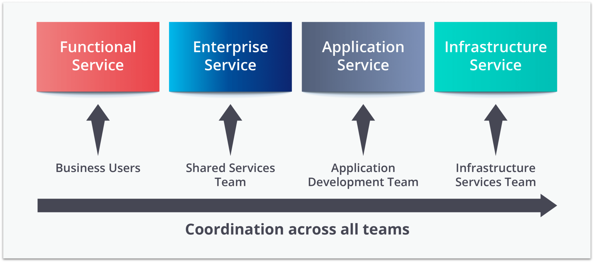

**Business Services:**

- Coarse-grained services that define core business operations.
- Represented through XML, Business Process Execution Language (BPEL), and others.

**Enterprise Services:**

- Implement the functionality defined by business services.
- Mainly rely on application services and infrastructure services to fulfill business requests.

**Application Services:**

- Fine-grained services that are confined to a specific application context.
- A dedicated user interface can directly invoke the services.

**Infrastructure Services:**

- Implement non-functional tasks such as authentication, auditing, security, and logging.
- Can be invoked from either application services or enterprise services.

Microservices have limited service taxonomy. They consist of two service types, as depicted below.

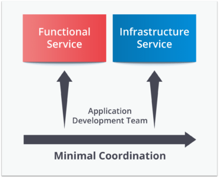

**Functional Services:**

- Support specific business operations.
- Accessing of services is done externally and these services are not shared with other services.
- As in SOA, infrastructure services implement tasks such as auditing, security, and logging.
- In this, the services are not unveiled to the outside world.

## Major Differences Between SOA and MSA

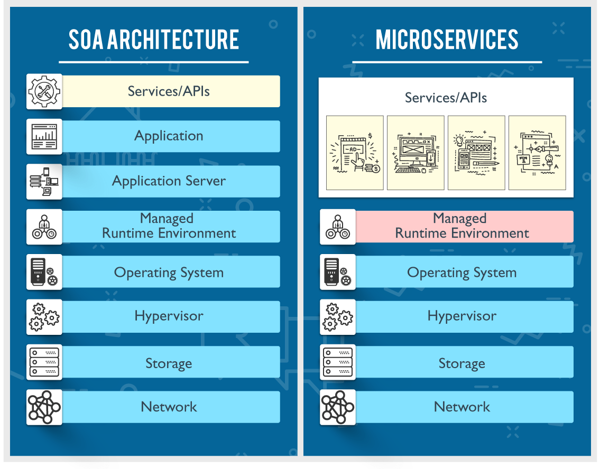

| SOA      |      MSA      |
|----------|:-------------:|
| Follows **“share-as-much-as-possible”** architecture approach | Follows **“share-as-little-as-possible”** architecture approach |
| Importance is on **business functionality** reuse | Importance is on the concept of **“bounded context”** |
| They have **common governance** and **standards** | They focus on **people, collaboration** and freedom of other options |
| Uses **Enterprise Service bus (ESB)** for communication | Simple messaging system |
| They support **multiple message protocols** | They use **lightweight protocols** such as **HTTP/REST** etc. |
| **Multi-threaded** with more overheads to handle I/O | **Single-threaded** usually with the use of Event Loop features for non-locking I/O handling |
| Maximizes application service reusability | Focuses on **decoupling** |
| **Traditional Relational Databases** are more often used | **Modern Relational Databases** are more often used |
| A systematic change requires modifying the monolith | A systematic change is to create a new service |
| DevOps / Continuous Delivery is becoming popular, but not yet mainstream | Strong focus on DevOps / Continuous Delivery |

## Major Differences Between Microservices and SOA in Detail

- **Service Granularity:** Service components within a microservices architecture are generally single-purpose services that do one thing really, really well. With SOA, service components can range in size anywhere from small application services to very large enterprise services. In fact, it is common to have a service component within SOA represented by a large product or even a subsystem.
- **Component Sharing:** Component sharing is one of the core tenets of SOA. As a matter of fact, component sharing is what enterprise services are all about. SOA enhances component sharing, whereas MSA tries to minimize on sharing through “bounded context.” A bounded context refers to the coupling of a component and its data as a single unit with minimal dependencies. As SOA relies on multiple services to fulfill a business request, systems built on SOA are likely to be slower than MSA.
- **Middleware vs API layer:** The microservices architecture pattern typically has what is known as an API layer, whereas SOA has a messaging middleware component. The messaging middleware in SOA offers a host of additional capabilities not found in MSA, including mediation and routing, message enhancement, message, and protocol transformation. MSA has an API layer between services and service consumers.
- **Remote services:** SOA architectures rely on messaging (AMQP, MSMQ) and SOAP as primary remote access protocols. Most MSAs rely on two protocols – REST and simple messaging (JMS, MSMQ), and the protocol found in MSA is usually homogeneous.
- **Heterogeneous interoperability:** SOA promotes the propagation of multiple heterogeneous protocols through its messaging middleware component. MSA attempts to simplify the architecture pattern by reducing the number of choices for integration. If you would like to integrate several systems using different protocols in a heterogeneous environment, you need to consider SOA. If all your services could be exposed and accessed through the same remote access protocol, then MSA is a better option.

In the end, I will say it is not that simple to tell which architecture is better than another. It mainly depends on the purpose of the application you are building. SOA is better suited for large and complex business application environments that require integration with many heterogeneous applications; smaller applications are not a good fit for SOA as they don’t need a messaging middleware component. Microservices, on the other hand, are better suited for smaller and well-partitioned, web-based systems in which microservices give you much greater control as a developer. The conclusion is that since they both have different architecture characteristics, it mainly depends on the purpose of the application you are building.

# Microservices and Cross-Cutting Concerns

## Overview

Although we often think of microservices as completely independent and self-contained units, this isn’t always the case. Sometimes it’s more convenient to think at a system level and lose some of that autonomy.

Let’s dive into these cross-cutting concerns and find out what they are.

## Security

One of the first things to consider is how security is involved in this architectural style. [Microservices architecture](https://www.baeldung.com/spring-microservices-guide) **is, by its nature, more distributed than other patterns**. The calls between components are larger and we must pay particular attention to policies aimed at preserving the security of data at rest, in transit, and use.

Given this nature, **the most vulnerable parts are API**. Building an API Gateway becomes advantageous as it acts as a single point of entry for calls coming from outside. In this way, it’s possible to reduce the attack surface, through appropriate whitelists, thus preventing potential attacks from malicious actors.

**Securing endpoints is critical**. For this reason, we must also explore the themes of Authorization and Authentication. Nowadays, the de facto standard for managing authorization is [OAuth / OAuth2 flows](https://baeldung.com/spring-security-oauth). On the other hand, the two-factor authentication helps to prevent and detect unwanted and malicious accesses for the authentication part.

## Configuration Management

Microservice Configuration Management concerns the change tracking process of the microservices themselves and the applications that consume them. In a microservice architecture, changes to a single microservice potentially impact the entire architecture. This means that it can potentially impact every consumer.

That said, **we must track the deployment of all microservices and their configurations**. In this way, by also adding all the surrounding elements (e.g. [Kubernetes](https://www.baeldung.com/ops/kubernetes) cluster, info relating to the infrastructure that hosts them), we can have the complete picture in the game.

Let’s imagine we’ve hundreds or thousands of microservices running in our clusters: we need a centralized place where all microservices can take their specific configuration, also based on the environment they’re running on.

## Log Aggregation and Distributed Tracing

Logging is an important part of software applications, letting us know what the code did when it ran. It gives us the ability to see when things are executing as expected and, perhaps more importantly, helps us to diagnose problems when they aren’t.

Having a microservices architecture leads to having several microservices running on the infrastructure. We may also have several instances of the same microservice. Each microservice writes its own logs in a standard format and contains info, warnings, errors, and debug messages.

Due to its innate separation of concerns, we often need to involve multiple microservices in these kinds of systems to fulfill a single request.
**This creates the need to collect and aggregate logs from across all microservices and, secondly, to have a mechanism that allows correlating all the internal calls necessary to observe the entire journey request:**

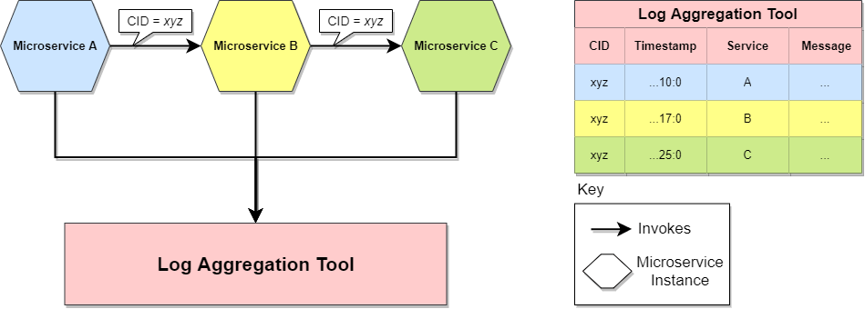

**These log aggregation tools leverage Correlation IDs (CID) and we use a single ID for a related set of service calls**. For example, the chain of calls that might be triggered as a result of a client request. By logging this ID as part of each log entry helps to isolate all the logs associated with a given call flow, making troubleshooting much simpler.

## Service Discovery and Load Balancing

Elasticity and reliability are two of the -ilities that microservices are best able to support.

**A microservices-based application typically runs in virtualized or containerized environments. The number of instances of a service and its locations change dynamically**. This is where tactics such as Service Discovery and Load Balancing come into play. We need to know where these instances are and their names to distribute incoming calls from outside.

We can imagine [Service Discovery](https://www.baeldung.com/spring-cloud-consul) as a Service Registry that keeps track of the location and name of each instance. In short, when a new instance is served and is ready to accept requests, it communicates its readiness to the designated node. The latter monitors the situation of all instances present, e.g., via ping/echo or heartbeat tactics.

On the other hand, load balancing is when we need to distribute the load to one of several instances based on an algorithm, removing instances when they are no longer healthy and putting them back on when they come back up. Other useful features can be for example SSL Termination to manage data security in transit of incoming call traffic and between microservices:

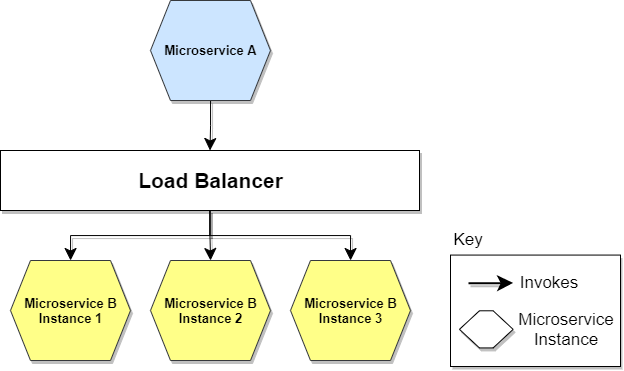

Both Service Discovery and Load Balancing are provided by tools such as [Service Mesh](https://www.baeldung.com/ops/istio-service-mesh) or orchestration systems such as Kubernetes.

## Shared Libraries

DRY (Don’t Repeat Yourself) is what leads us to create reusable code. In general, it makes sense. An evergreen topic when it comes to microservices is whether or not to use shared libraries. Of course, just because it can be done doesn’t mean it’s right to do it.

The first point is that if we’re talking about sharing code, we’re reducing the freedom to have heterogeneous technologies. A Java Shared Library can influence us to build other Java-based microservices. This isn’t necessarily a con, but it should be emphasized.

Basically, **implementing microservices means sharing responsibilities and reducing coupling**. Introducing shared libraries goes against the main philosophy of this architectural style. It’s important to understand why we want to introduce a shared library. If we’ve applied techniques such as DDD correctly, we’ll have a very cohesive and poorly coupled architecture. We would like to preserve these concepts.

**When we’ve got a shared library within our microservices, we must accept that a change to its code forces us to redistribute those microservices, undermining one of the fundamental properties of microservices: independent deployability**.
This property is best preserved if we don’t want to increase deployment complexity or, taken to the extreme, find ourselves dealing with a distributed monolith.

Sharing code in microservices isn’t necessarily always wrong, but definitely something to think twice about.

## Sidecar

The Sidecar Pattern is perhaps the most cross-cutting concern of all. When we talk about microservice architectures, we also talk about the possibility of having a polyglot system. In other words, we’ve got the freedom to choose the language, technology, or framework based on the task we need to solve.

This leads, potentially, to having microservices that speak different languages making it more difficult to maintain cross-cutting libraries of concern.
One solution to this is the sidecar pattern. **The logic for cross-cutting concerns is placed in its own processor container** (known as a sidecar container) **and then linked to the primary application**. Similar to how a motorcycle sidecar is connected to a motorcycle, the sidecar application is connected to the primary application and runs alongside it:

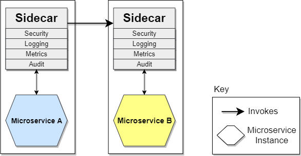

The sidecar application can then deal with concerns such as logging, monitoring, authorization and authentication, and other cross-cutting concerns. In this way, each microservice would have its sidecar instance equal to the other microservices, thereby increasing cross-cutting concerns maintainability and management.

## Conclusion

This article went over some of the more interesting and useful cross-cutting concerns related to Microservices Architecture. As we have seen, we can decide to create reusable implementations to use in many microservices or implement such concerns in each microservice. In the case of the former, we create coupling between microservices, while the latter will require some extra effort. Depending on the context of our system it will be necessary to choose the right tradeoff.

# Related reading

- [Introduction to Microservices](https://www.nginx.com/blog/introduction-to-microservices/)
- [Pattern: Monolithic Architecture](https://microservices.io/patterns/monolithic.html)
- [Pattern: Microservice Architecture](https://microservices.io/patterns/microservices.html)
- [Monolithic vs. Microservices Architecture: How the Software Structure Can Influence the Efficiency](https://magora-systems.com/monolithic-architecture-vs-microservices/)
- [10 Microservice Best Practices](https://www.simform.com/blog/microservice-best-practices/)
- [What Is SOA? Service-Oriented Architecture Explained](https://www.bmc.com/blogs/service-oriented-architecture-overview/)
- [SOA vs. Microservices: What’s the Difference?](https://www.ibm.com/cloud/blog/soa-vs-microservices)
- [What is REST](https://restfulapi.net/)
- [SOAP vs. REST: A Look at Two Different API Styles](https://www.upwork.com/resources/soap-vs-rest-a-look-at-two-different-api-styles)
- [REST vs. RESTFUL: What’s the Difference?](https://blog.ndepend.com/rest-vs-restful/)
- [What is the Difference Between RESTFUL and RESTLESS Web Service](https://pediaa.com/what-is-the-difference-between-restful-and-restless-web-service/)
- [Microservices Foundations](https://www.linkedin.com/learning/microservices-foundations/welcome?autoplay=true&u=2113185) [Video course]
- [Creating Your First Spring Boot Microservice](https://www.linkedin.com/learning/creating-your-first-spring-boot-microservice/build-a-microservice-with-spring-boot?autoplay=true&u=2113185) [Video course]

# Questions

 - What is a microservice?
 - What is the difference between architecture styles -monolith, SOA, microservices?
 - Could you provide practical samples in which cases which architecture style you will select?
 - What are the advantages of microservices?
 - What are the disadvantages of microservices?
 - What is cross-cutting concerns? Describe types you know?
