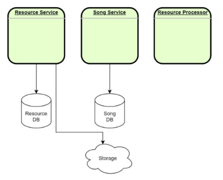

# Table of Content

- [What to do](#what-to-do)
- [Sub-task 1: Resource Service](#sub-task-1-resource-service)
- [Sub-task 2: Resource Processor](#sub-task-2-resource-processor)

## What to do

To execute this module, should be used a ready-made artifact obtained after executing the [introduction-to-microservices](https://git.epam.com/epm-cdp/global-java-foundation-program/java-courses/-/tree/main/introduction-to-microservices) program and make some changes to the base structure of microservices system.
During this task you need to:

+ Make structural changes to existing microservices:
  - **Resource Service**

+ Implement a new microservice:
  - **Resource Processor**

## Sub-task 1: Resource Service

For a **Resource Service**, it is recommended to make structural changes as described bellow.
- **Resource Service** should use cloud storage or its emulation (e.g. [S3 emulator](https://github.com/localstack/localstack)) to store the source file. Previously, the resource file was stored in the service database.
- Resource tracking (with resource location in the cloud storage) should be carried out in the underlying database of the service.

When uploading a mp3 file, the **Resource Service** should process the file in this way:
- Save the source file to a cloud storage or its emulation (e.g. [S3 emulator](https://github.com/localstack/localstack)).
- Save resource location (location in the cloud storage) in the underlying database of the service.
- The **Resource Service** should not invoke any other services this time.

## Sub-task 2: Resource Processor

This service will be used to process the source MP3 data in the future and will not have a web interface. At this point,
this should be a basic Spring Boot application capable of extracting MP3 metadata for further storage using the **Song Service** API.
An external library can be used for this purpose.(e.g. [Apache Tika](https://www.tutorialspoint.com/tika/tika_extracting_mp3_files.htm)).

Implement initial version of each service:

- Basic structure (Spring Boot)

